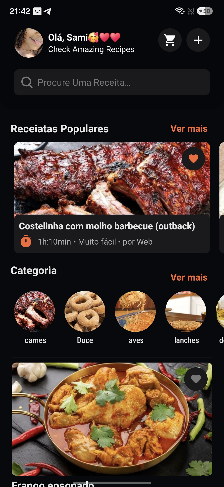
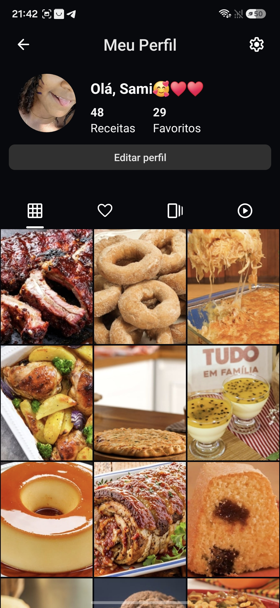
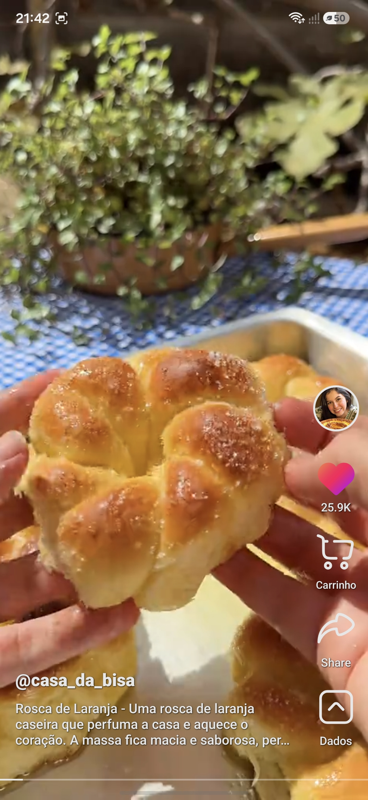
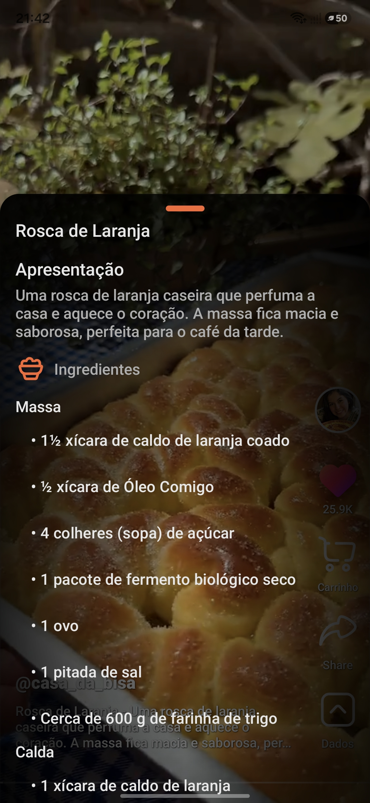
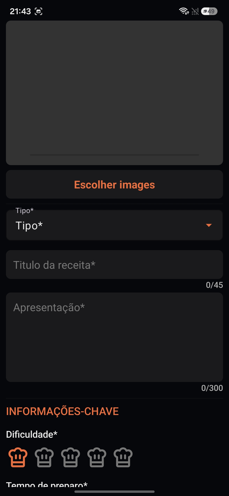
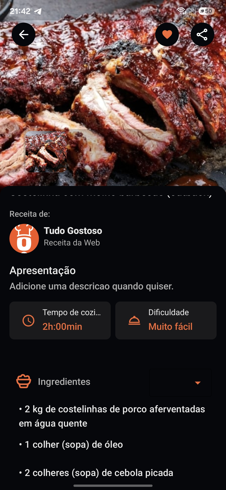
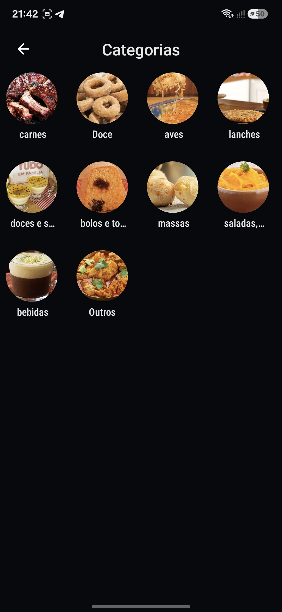
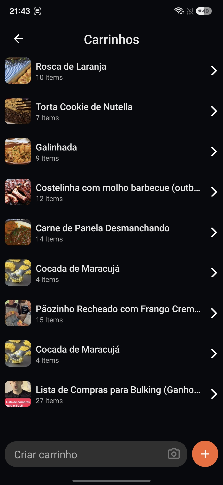

# 🍳 TopChef

<p align="center">
  
  
  
  
  
</p>

<p align="center">
  <strong>TopChef</strong> é um aplicativo Android para organizar, descobrir e importar receitas de diferentes fontes em um único lugar.
</p>

---

## 📱 Sobre o projeto

O **TopChef** foi desenvolvido para facilitar a organização de receitas e transformar receitas encontradas na internet em uma coleção pessoal.

O aplicativo permite cadastrar receitas manualmente, organizar receitas por categorias, favoritar pratos, criar listas de compras e importar receitas encontradas em plataformas como **TudoGostoso** e **TikTok**.

A proposta é tornar o processo simples:

> 🔎 Encontrou uma receita → 📲 compartilhe com o TopChef → 🍳 organize → 🛒 prepare sua lista de compras → 👨‍🍳 cozinhe.

---

## ✨ Funcionalidades

### 🍽️ Gerenciamento de receitas

* Cadastro de receitas próprias
* Título, descrição e categoria
* Tempo de preparo
* Tempo de cozimento
* Tempo total
* Ingredientes
* Modo de preparo
* Adição de imagens
* Visualização detalhada da receita
* Sistema de favoritos
* Organização por categorias

### 🌐 Importação de receitas

O TopChef consegue receber receitas através do compartilhamento do Android.

#### 🥘 TudoGostoso

É possível compartilhar uma receita do TudoGostoso diretamente para o TopChef.

O aplicativo identifica o link compartilhado e realiza a extração das informações da receita, incluindo:

* Nome
* Descrição
* Ingredientes
* Modo de preparo
* Tempos
* Categoria
* Imagens

A ideia é evitar que o usuário precise copiar manualmente toda a receita.

#### 🎵 TikTok + Inteligência Artificial

Receitas encontradas no TikTok também podem ser enviadas para o TopChef através do compartilhamento.

O fluxo utiliza:

**TikTok → TopChef → processamento do conteúdo → Gemini → receita estruturada**

A inteligência artificial é utilizada para transformar as informações presentes no conteúdo em uma estrutura de receita.

O resultado é convertido para um modelo estruturado contendo informações como:

```json
{
  "name": "Nome da receita",
  "description": "Descrição",
  "ingredients": [],
  "preparation_mode": []
}
```

Isso permite transformar uma receita apresentada de forma informal em uma receita organizada dentro do aplicativo.

---

## 🤖 Inteligência Artificial

O TopChef possui integração com a **Google Gemini API** para auxiliar na interpretação de receitas provenientes do TikTok.

O objetivo é utilizar IA para identificar informações importantes dentro do conteúdo compartilhado e convertê-las para o formato utilizado pelo aplicativo.

### Fluxo

```text
┌───────────────┐
│     TikTok    │
└───────┬───────┘
        │
        │ Compartilhar
        ▼
┌───────────────┐
│    TopChef    │
└───────┬───────┘
        │
        │ Extrai conteúdo
        ▼
┌───────────────┐
│   Gemini AI   │
└───────┬───────┘
        │
        │ Receita estruturada
        ▼
┌───────────────┐
│ Recipe Model  │
└───────┬───────┘
        │
        ▼
┌───────────────┐
│  Room Database│
└───────────────┘
```

---

## 🛒 Lista de compras

O aplicativo possui um sistema de listas de compras integrado às receitas.

É possível:

* Criar listas
* Adicionar ingredientes
* Editar itens
* Reordenar itens
* Marcar itens
* Compartilhar listas
* Organizar os itens para facilitar as compras

A lista foi pensada para funcionar junto com o processo de preparação das receitas.

```text
Receita
   │
   ├── Ingrediente 1
   ├── Ingrediente 2
   ├── Ingrediente 3
   └── Ingrediente 4
           │
           ▼
     Lista de compras
```

---

## 📲 Compartilhamento

O TopChef utiliza o sistema de compartilhamento do Android para receber conteúdos de outros aplicativos.

Exemplo:

```text
TikTok
   │
   │ Compartilhar
   ▼
TopChef
```

ou:

```text
TudoGostoso
   │
   │ Compartilhar
   ▼
TopChef
```

O aplicativo identifica o tipo de conteúdo recebido e direciona o usuário para o fluxo de importação correspondente.

---

## 💾 Banco de dados

O armazenamento local das informações é feito utilizando **Room Database**.

Entre os dados armazenados estão:

* Receitas
* Categorias
* Listas de compras
* Usuário
* Favoritos
* Informações relacionadas às receitas

A utilização do Room permite que o aplicativo mantenha os dados disponíveis localmente, inclusive sem depender constantemente de uma conexão com a internet.

### Estrutura simplificada

```text
Room Database
│
├── Recipe
│
├── Type
│
├── Cart
│
└── User
```

---

## 🏗️ Arquitetura

O projeto utiliza uma organização baseada em separação de responsabilidades, mantendo as funcionalidades divididas por módulos/features.

Estrutura simplificada:

```text
com.sam.topchef
│
├── core
│   └── data
│       └── local
│           ├── app
│           └── appDataBase
│
├── feature_recipe
│
├── feature_cart
│
├── feature_home
│
├── feature_import
│
└── ...
```

O projeto utiliza componentes como:

* Activities
* Fragments
* RecyclerView
* Adapters
* ViewBinding
* Room
* Coroutines
* Lifecycle
* Glide

---

## 🛠️ Tecnologias utilizadas

| Tecnologia             | Utilização                                         |
| ---------------------- | -------------------------------------------------- |
| **Kotlin**             | Linguagem principal                                |
| **Android SDK**        | Desenvolvimento Android                            |
| **XML**                | Construção das interfaces                          |
| **ViewBinding**        | Acesso seguro às Views                             |
| **Room**               | Banco de dados local                               |
| **KSP**                | Processamento de código                            |
| **Coroutines**         | Operações assíncronas                              |
| **Lifecycle**          | Gerenciamento do ciclo de vida                     |
| **RecyclerView**       | Listas e feeds                                     |
| **Glide**              | Carregamento de imagens                            |
| **Gemini API**         | Processamento de receitas com IA                   |
| **Media3 / ExoPlayer** | Reprodução de conteúdo                             |
| **Jsoup**              | Extração de informações de páginas                 |
| **Selenium**           | Automação/extração em páginas que exigem navegador |

---

## 🎨 Interface

O TopChef possui uma interface focada em:

* Navegação simples
* Cards de receitas
* Imagens grandes
* Categorias
* Receitas populares
* Receitas favoritas
* Listas de compras
* Tela detalhada da receita
* Fluxos específicos para importação

A tela principal organiza diferentes tipos de conteúdo através de listas e seções, permitindo ao usuário descobrir rapidamente suas receitas.

---

## 🔄 Fluxo principal

```text
                     ┌──────────────┐
                     │    TopChef   │
                     └──────┬───────┘
                            │
             ┌──────────────┼──────────────┐
             │              │              │
             ▼              ▼              ▼
        Cadastrar       Importar       Explorar
         receita         receita        receitas
             │              │              │
             │       ┌──────┴──────┐       │
             │       │             │       │
             │       ▼             ▼       │
             │  TudoGostoso     TikTok    │
             │                     │       │
             │                     ▼       │
             │                  Gemini    │
             │                     │       │
             └──────────┬──────────┘       │
                        ▼                  │
                  Recipe / Room ◄─────────┘
                        │
              ┌─────────┴─────────┐
              ▼                   ▼
         Favoritos          Lista de compras
```

---

## 🚀 Objetivo do projeto

O TopChef nasceu como um projeto para estudar e aplicar conceitos de desenvolvimento Android, mas evoluiu para uma aplicação completa de gerenciamento de receitas.

O projeto busca explorar na prática:

* Desenvolvimento Android moderno com Kotlin
* Persistência local
* Arquitetura de aplicações
* Consumo de APIs
* Web scraping
* Integração com inteligência artificial
* Processamento de conteúdo multimídia
* Compartilhamento entre aplicativos
* Criação de interfaces utilizando XML
* Gerenciamento de grandes listas de dados

---

## 🔮 Possíveis próximos passos

Algumas funcionalidades que podem fazer parte da evolução do TopChef:

* [ ] Backup e restauração das receitas
* [ ] Backup utilizando Google Drive
* [ ] Sincronização entre dispositivos
* [ ] Conta de usuário
* [ ] Compartilhamento de receitas entre usuários
* [ ] Melhorias no sistema de importação
* [ ] Mais fontes de receitas
* [ ] Geração automática de listas de compras
* [ ] Busca avançada
* [ ] Filtros por ingredientes e categorias
* [ ] Melhorias no processamento por IA
* [ ] Recomendações de receitas
* [ ] Modo offline mais completo

---

## 📸 Screenshots

<p align="center">
  
  
  
  
</p>

<p align="center">
  
  
  
  
</p>

---

## ⚙️ Como executar

### Pré-requisitos

* Android Studio
* JDK 17
* Android SDK 36
* Dispositivo Android ou emulador

### Instalação

Clone o repositório:

```bash
git clone https://github.com/SEU_USUARIO/topchef.git
```

Abra o projeto no Android Studio e aguarde a sincronização do Gradle.

Depois execute o aplicativo em um dispositivo ou emulador Android.

### Gemini API

Para utilizar a funcionalidade de importação de receitas através de IA, é necessário configurar uma chave da **Gemini API**.

> ⚠️ Nunca publique sua API Key diretamente no repositório.

---

## 📚 O que este projeto demonstra

O TopChef reúne diferentes conceitos em um único aplicativo Android:

```text
Android
  │
  ├── Kotlin
  ├── XML
  ├── Room
  ├── Coroutines
  ├── RecyclerView
  ├── Glide
  │
  ├── Web
  │   ├── Jsoup
  │   └── Selenium
  │
  ├── IA
  │   └── Gemini
  │
  ├── Multimídia
  │   └── Media3
  │
  └── Android Share Intent
```

---

## 👨‍💻 Autor

Desenvolvido por **Wladson Silva**.

Projeto desenvolvido com foco em aprendizado, experimentação e construção de uma aplicação Android completa.

---

<p align="center">
  🍳 <strong>TopChef</strong> — suas receitas, em um só lugar.
</p>
