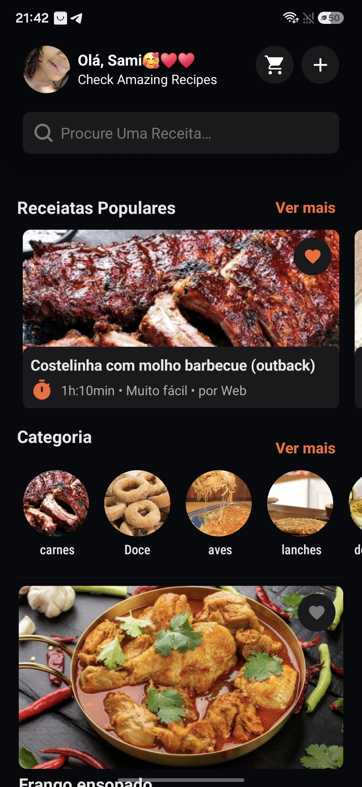
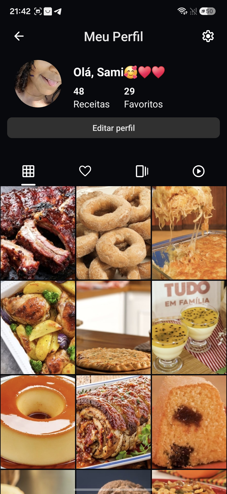
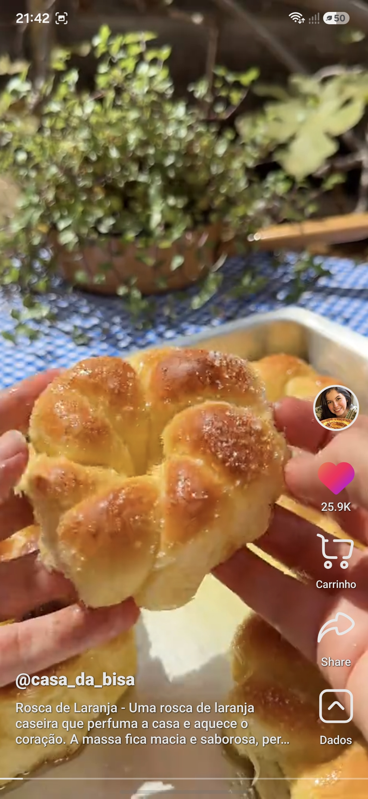
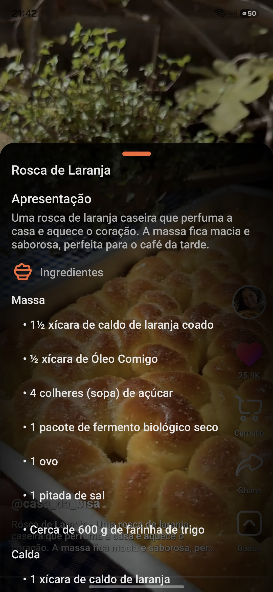
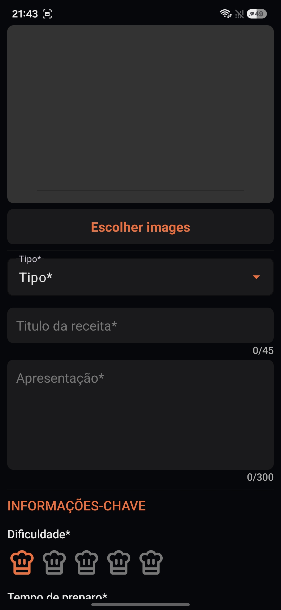
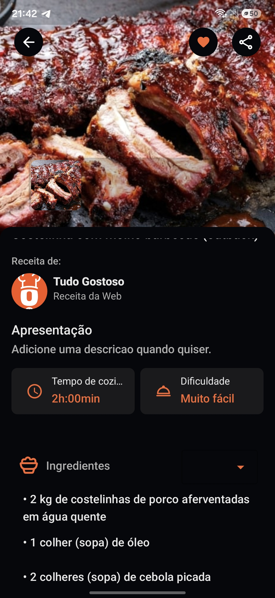
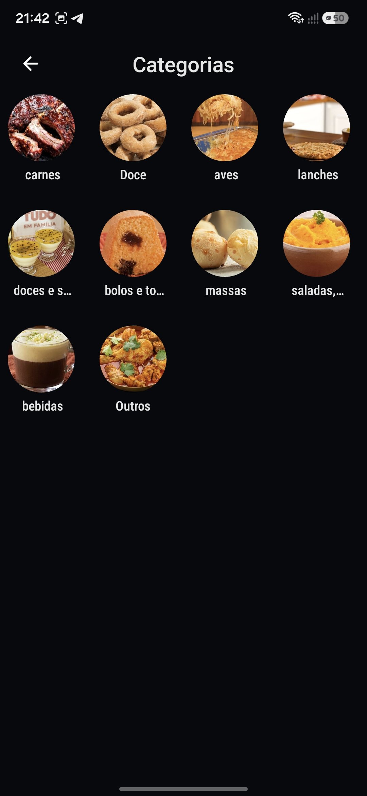
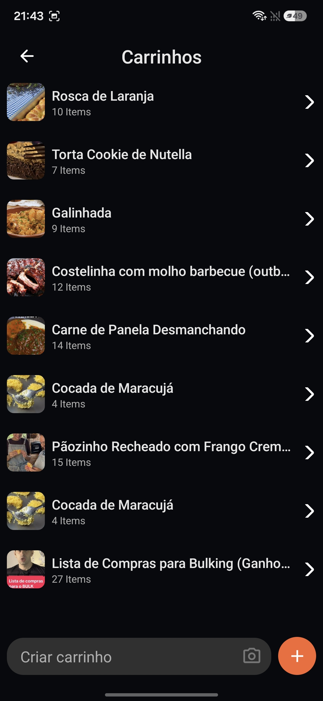

# 🍳 TopChef

<p align="center">
  
  
  
  
  
</p>

<p align="center">
  <strong>TopChef</strong> é um aplicativo Android para organizar, descobrir e importar receitas de diferentes fontes em um único lugar.
</p>

---

## 📱 Sobre o projeto

O **TopChef** foi desenvolvido para facilitar a organização de receitas e transformar receitas encontradas na internet em uma coleção pessoal.

O aplicativo permite cadastrar receitas manualmente, organizar receitas por categorias, favoritar pratos, porcionar receitas proporcionalmente, criar listas de compras e importar receitas encontradas em plataformas como **TudoGostoso** e **TikTok**.

A proposta é tornar o processo simples:

> 🔎 Encontrou uma receita → 📲 compartilhe com o TopChef → 🍳 organize → 📏 porcione → 🛒 prepare sua lista de compras → 👨‍🍳 cozinhe.

---

## ✨ Funcionalidades

### 🍽️ Gerenciamento de receitas

* Cadastro de receitas próprias (título, descrição, categoria, tempos, dificuldade)
* Adição e exibição de múltiplas imagens com modo tela cheia
* **Porcionamento Proporcional de Receitas**:
  * Recálculo automático dos ingredientes por fatores como **1x (Padrão)**, **2x (Dobro)**, **1/2 (Metade)** ou **Personalizado** (qualquer multiplicador ou fração)
  * Algoritmo inteligente que identifica e recalcula inteiros, decimais, frações e numerais por extenso (ex: *uma xícara*, *duas colheres*, *meia colher*)
  * Ajuste gramatical automático de unidades para singular e plural (ex: *xícara* ➔ *xícaras*, *colher* ➔ *colheres*)
* Visualização detalhada e temporizador de cozimento integrado com serviço em segundo plano
* Sistema de favoritos e navegação por categorias
* **Menu Unificado de Ferramentas de Receita (`RecipeToolsDialog`)**:
  * Acessível via clique longo (`longClickListener`) em qualquer receita do app (TikTok, TudoGostoso ou Receita do App)
  * Permite abrir, editar, compartilhar texto/link, mover ingredientes direto para a lista de compras ou excluir a receita com confirmação e remoção no banco de dados

### 🌐 Importação de receitas e Feed Web

O TopChef consegue receber e importar receitas de diversas fontes externas.

* **Pull-to-Refresh (SwipeRefreshLayout)**: Atualização por arraste no feed web e buscas de receitas.

#### 🥘 TudoGostoso

Compartilhe ou busque receitas do TudoGostoso diretamente no aplicativo.

O TopChef realiza a extração automática das informações da página web:
* Nome, descrição, ingredientes, modo de preparo, tempos, categoria e imagens.

#### 🎵 TikTok + Inteligência Artificial (Gemini)

Receitas encontradas no TikTok enviadas via compartilhamento do Android.

O fluxo utiliza:

**TikTok → TopChef → processamento do conteúdo → Gemini AI → receita estruturada**

A inteligência artificial transforma conteúdos informais do vídeo em uma estrutura organizada de receita (ingredientes e modo de preparo).

```json
{
  "name": "Nome da receita",
  "description": "Descrição",
  "ingredients": [],
  "preparation_mode": []
}
```

---

## 🤖 Inteligência Artificial

O TopChef possui integração com a **Google Gemini API** para interpretar e estruturar receitas provenientes do TikTok.

### Fluxo

```text
┌───────────────┐
│     TikTok    │
└───────┬───────┘
        │ Compartilhar
        ▼
┌───────────────┐
│    TopChef    │
└───────┬───────┘
        │ Extrai conteúdo
        ▼
┌───────────────┐
│   Gemini AI   │
└───────┬───────┘
        │ Receita estruturada
        ▼
┌───────────────┐
│ Recipe Model  │
└───────┬───────┘
        │ Salva localmente
        ▼
┌───────────────┐
│  Room Database│
└───────────────┘
```

---

## 🛒 Lista de compras

O aplicativo possui um sistema de listas de compras integrado diretamente às receitas.

* Criar e organizar carrinhos/listas
* Mover automaticamente ingredientes de qualquer receita para uma lista de compras
* Adicionar, editar, reordenar e desmarcar itens
* Compartilhar a lista de compras como texto

---

## 💾 Banco de dados

O armazenamento local é gerenciado pelo **Room Database**.

Entre os dados armazenados estão:
* Receitas locais
* Receitas importadas do TikTok
* Categorias e tipos
* Carrinhos e itens de compras
* Usuário e favoritos

---

## 🛠️ Tecnologias utilizadas

| Tecnologia                  | Utilização                                         |
| --------------------------- | -------------------------------------------------- |
| **Kotlin**                  | Linguagem principal                                |
| **Android SDK / XML**       | Interface nativa do usuário                        |
| **ViewBinding**             | Acesso seguro às Views                             |
| **Room Database**           | Armazenamento e persistência local                 |
| **Coroutines & Lifecycle**  | Processamento assíncrono e gerenciamento de estado |
| **SwipeRefreshLayout**      | Atualização de listas por arraste (Pull-to-refresh)|
| **RecyclerView & Adapters** | Exibição otimizada de listas e feeds               |
| **Glide**                   | Carregamento e cache de imagens                    |
| **Gemini API**              | Processamento e estruturação de receitas com IA    |
| **Media3 / ExoPlayer**      | Reprodução de vídeos                               |
| **Jsoup**                   | Extração de receitas web (Scraping)                |

---

## 📸 Screenshots

<p align="center">
  
  
  
  
</p>

<p align="center">
  
  
  
  
</p>

---

## ⚙️ Como executar

### Pré-requisitos

* Android Studio
* JDK 17
* Android SDK 36
* Dispositivo Android ou emulador

### Passos

1. Clone o repositório:
```bash
git clone https://github.com/WladsonSilva/topchef.git
```
2. Abra o projeto no Android Studio e aguarde a sincronização das dependências do Gradle.
3. Configure sua chave da Gemini API no arquivo `local.properties`:
```properties
GEMINI_FLASH="sua_chave_aqui"
```
4. Execute o aplicativo em um emulador ou dispositivo físico.

---

## 👨‍💻 Autor

Desenvolvido por **Wladson Silva**.

<p align="center">
  🍳 <strong>TopChef</strong> — suas receitas, em um só lugar.
</p>
